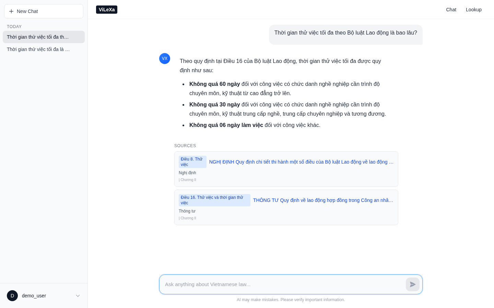
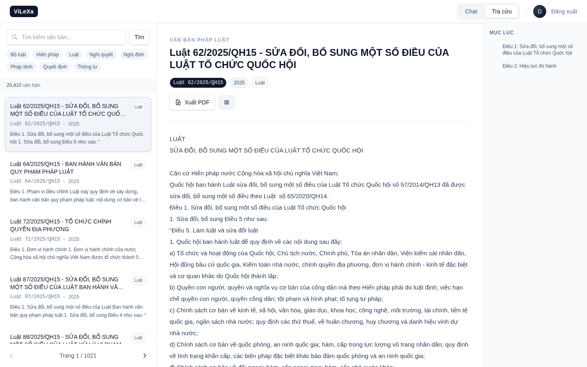

<div align="center">

# ViLeXa — Vietnamese Legal Expert Assistant

**An Agentic RAG system for Vietnamese legal documents, powered by LangGraph, Qdrant, and Gemini.**

[](https://python.org)
[](https://fastapi.tiangolo.com)
[](https://react.dev)
[](https://typescriptlang.org)
[](https://langchain-ai.github.io/langgraph/)
[](https://qdrant.tech)
[](https://docker.com)
[](LICENSE)

</div>

---

## Overview

Vietnamese legal documents are complex, hierarchical, and notoriously difficult to navigate. Citizens and legal professionals must sift through thousands of Laws (Luật), Decrees (Nghị định), Circulars (Thông tư), and Decisions (Quyết định) to find relevant provisions — a process that can take hours.

**ViLeXa** solves this by combining modern Retrieval-Augmented Generation with an agentic pipeline that thinks before it answers. Instead of blindly retrieving and generating, ViLeXa:

1. **Classifies** whether a query actually needs legal document retrieval
2. **Retrieves** documents using hybrid dense + sparse vector search
3. **Grades** each document for relevance using the LLM itself
4. **Rewrites** the query up to 3 times if no relevant documents are found
5. **Generates** accurate, citation-backed responses in Vietnamese

The result is a system that achieved **77.3% Hit Rate@1** and **95.0% Recall@10** on the Zalo AI Legal Retrieval benchmark (150 queries), with **NDCG@10 of 0.867** and **MRR of 0.842**.

---

## Screenshots

<!-- TODO: Add screenshots after demo recording -->

| Chat Interface | Document Lookup | Evaluation Dashboard |
|---|---|---|
|  |  |  |

---

## Key Features

| Feature | Description |
|---------|-------------|
| **Agentic RAG Pipeline** | Multi-step agentic pipeline with query routing, document grading, and adaptive retry |
| **Hybrid Search** | Dense + Sparse vector retrieval via Qdrant's native fusion — combining semantic similarity with lexical matching |
| **Cross-Encoder Reranker** | `Alibaba-NLP/gte-multilingual-reranker-base` for precision reranking (optional, improves precision at k=10) |
| **Vietnamese Embeddings** | `AITeamVN/Vietnamese_Embedding_v2` — 1024-dim BGE-M3 fine-tuned for Vietnamese |
| **Hierarchical Chunking** | Part → Chapter → Section → Article structure-aware document splitting |
| **Legal Document Crawler** | Automated scraping from the Vietnamese National Legal Information Portal (vbpl.vn) |
| **JWT Authentication** | Secure user registration, login, and session management |
| **Persistent Chat History** | SQLite-backed session storage with full message and source tracking |
| **Multi-Pipeline Support** | GTE, Vietnamese Embedding, BGE-M3, and Agentic pipelines — swappable at config |
| **GPU Acceleration** | NVIDIA CUDA support with torch.compile, TF32, and FP16 optimizations |
| **Docker Deployment** | 3-service architecture (backend, Qdrant, frontend) with GPU passthrough |
| **DeepEval Integration** | Automated RAG evaluation with AnswerRelevancy and Faithfulness metrics |

---

## Architecture

### System Architecture

```
┌─────────────────────────────────────────────────────────────────────────┐
│                          React Frontend (Vite)                          │
│                  Chat UI · Document Browser · Auth Flow                 │
└───────────────────────────────┬─────────────────────────────────────────┘
                                │ HTTP / REST API
                                ▼
┌─────────────────────────────────────────────────────────────────────────┐
│                        FastAPI Backend (Python)                         │
│                                                                         │
│   ┌──────────┐  ┌──────────┐  ┌──────────┐  ┌──────────────────────┐  │
│   │   Auth   │  │   Chat   │  │ Sessions │  │   Document Lookup    │  │
│   │  (JWT)   │  │  (RAG)   │  │  (CRUD)  │  │  (Browse / Search)   │  │
│   └────┬─────┘  └────┬─────┘  └────┬─────┘  └──────────┬───────────┘  │
│        │              │              │                    │              │
│        ▼              ▼              ▼                    ▼              │
│   ┌──────────┐  ┌──────────┐  ┌──────────┐       ┌──────────┐         │
│   │  SQLite  │  │ LangGraph│  │  SQLite  │       │  File    │         │
│   │  (Auth)  │  │  Agentic │  │ (Sessions│       │  System  │         │
│   │          │  │  Pipeline│  │  & Msgs) │       │  (JSON)  │         │
│   └──────────┘  └────┬─────┘  └──────────┘       └──────────┘         │
│                       │                                                │
│              ┌────────┴────────┐                                       │
│              ▼                 ▼                                       │
│       ┌──────────┐     ┌──────────┐                                   │
│       │  Qdrant  │     │  Google  │                                   │
│       │ (Hybrid  │     │  Gemini  │                                   │
│       │ Vectors) │     │   LLM    │                                   │
│       └──────────┘     └──────────┘                                   │
└─────────────────────────────────────────────────────────────────────────┘
```

### Agentic RAG Pipeline

The core innovation is a multi-step agentic LangGraph state machine that routes, retrieves, evaluates, and adapts:

```
                         ┌────────────────┐
                         │   User Query   │
                         └───────┬────────┘
                                 │
                         ┌───────▼────────┐
                         │  route_query   │  LLM classifies: does this need
                         │  (Classifier)  │  legal document retrieval?
                         └───────┬────────┘
                          ┌──────┴──────┐
                         YES            NO
                          │              │
                 ┌────────▼────────┐    │
                 │    retrieve     │    │
                 │ (Qdrant Hybrid  │    │
                 │  + Reranker)    │    │
                 └────────┬────────┘    │
                          │             │
                 ┌────────▼────────┐   │
                 │ grade_documents │   │  LLM evaluates each
                 │ (Relevance)     │   │  document's relevance
                 └────────┬────────┘   │
                          │            │
              ┌───────────┼───────────┐│
             YES          NO      MAX RETRIES
              │            │            │
   ┌──────────▼──┐  ┌──────▼──────┐   │
   │  generate   │  │   rewrite   │   │
   │ _with_ctx   │  │   _query    │   │  Reformulates query,
   │(Grounded)   │  │  (Adaptive) │   │  loops back to retrieve
   └──────────┬──┘  └──────┬──────┘   │
              │             │          │
              │      ┌──────▼──────┐   │
              │      │  retrieve   │───┘  (max 3 attempts)
              │      │  (retry)    │
              │      └─────────────┘
              │                       │
              │              ┌────────▼────────┐
              │              │  handle_no_docs  │  Graceful fallback
              │              │  (Suggestion)    │
              │              └────────┬────────┘
              │                       │
              ▼                       ▼
   ┌─────────────────────────────────────────┐
   │            Final Response               │
   │   Answer + Legal Citations + Sources    │
   └─────────────────────────────────────────┘
```

### State Flow

| State Field | Type | Description |
|-------------|------|-------------|
| `query` | `str` | Original user query (immutable) |
| `current_query` | `str` | Current query (may be rewritten) |
| `history` | `List[BaseMessage]` | Chat history for multi-turn |
| `documents` | `List[Document]` | Retrieved documents from Qdrant |
| `relevant_documents` | `List[Document]` | Filtered by LLM grading |
| `rewrite_count` | `int` | Current retry attempt (max 3) |
| `needs_retrieval` | `bool` | Route decision result |
| `answer` | `str` | Generated response |
| `sources` | `List[Dict]` | Document metadata for citations |

---

## Tech Stack

### Backend

| Component | Technology | Version | Purpose |
|-----------|------------|---------|---------|
| Framework | FastAPI | 0.127+ | Async REST API |
| Language | Python | 3.10+ | Core runtime |
| Orchestration | LangGraph | 0.2+ | Agentic RAG pipeline |
| LLM | Google Gemini | `gemini-2.5-flash-lite` | Query routing, grading, generation |
| Vector DB | Qdrant | 1.7+ | Hybrid dense + sparse retrieval |
| Embeddings | AITeamVN/Vietnamese_Embedding_v2 | 1024-dim | BGE-M3 fine-tuned for Vietnamese |
| Reranker | Alibaba-NLP/gte-multilingual-reranker-base | CrossEncoder | Precision reranking |
| Auth DB | SQLite + SQLAlchemy | - | User accounts, sessions, messages |
| Security | JWT (PyJWT) | - | Token-based authentication |

### Frontend

| Component | Technology | Version | Purpose |
|-----------|------------|---------|---------|
| Framework | React | 19.2+ | UI framework |
| Language | TypeScript | 5.9+ | Type-safe development |
| Bundler | Vite (rolldown) | 7.2+ | Fast build tooling |
| Styling | Tailwind CSS | 4.1+ | Utility-first CSS |
| Routing | React Router | 7.11+ | Client-side routing |
| Markdown | react-markdown | 10.1+ | Chat message rendering |

### Infrastructure

| Component | Technology | Purpose |
|-----------|------------|---------|
| Containerization | Docker + Docker Compose | Multi-service orchestration |
| GPU | NVIDIA CUDA | Embedding + reranker acceleration |
| Crawler | requests + BeautifulSoup | Legal document scraping from vbpl.vn |
| Evaluation | DeepEval + Custom IR Metrics | RAG quality assessment |

---

## Project Structure

```
ViLeXa/
├── backend/                         # FastAPI + LangGraph + Qdrant
│   ├── api/
│   │   └── v1/                     # REST API endpoints
│   │       ├── auth.py             # Register, login, JWT
│   │       ├── chat.py             # RAG chat with history
│   │       ├── sessions.py         # Session CRUD
│   │       └── lookup.py           # Document browsing
│   ├── core/
│   │   ├── config.py               # Pydantic settings (env-based)
│   │   ├── database.py             # SQLAlchemy engine & session
│   │   ├── security.py             # JWT token creation/validation
│   │   └── logging.py              # Structured logging setup
│   ├── db/models/                  # SQLAlchemy ORM models
│   │   ├── user.py                 # User accounts
│   │   ├── chat_session.py         # Chat sessions
│   │   ├── message.py              # Messages + sources
│   │   └── message_source.py       # Citation metadata
│   ├── models/                     # Pydantic request/response schemas
│   │   ├── auth.py                 # UserCreate, TokenResponse
│   │   ├── chat.py                 # ChatRequest, ChatResponse
│   │   ├── session.py              # SessionCreate, MessageResponse
│   │   └── lookup.py               # DocumentResponse
│   └── services/
│       ├── chat_service.py         # Chat orchestration
│       ├── auth_service.py         # User management
│       ├── session_service.py      # Session persistence
│       ├── lookup_service.py       # Document search & retrieval
│       ├── adapters.py             # Embedding adapters (GTE, Vietnamese, BGE-M3)
│       ├── pipelines/              # RAG pipeline implementations
│       │   ├── base.py             # Abstract RAGPipeline interface
│       │   ├── agentic_rag_pipeline.py  # LangGraph agentic workflow
│       │   ├── gte_pipeline.py     # Alibaba GTE pipeline
│       │   ├── vietnamese_embedding_pipeline.py  # Vietnamese BGE-M3
│       │   └── bge_m3_pipeline.py  # BAAI BGE-M3 pipeline
│       └── rerankers/
│           ├── base.py             # Abstract BaseReranker interface
│           └── cross_encoder.py    # CrossEncoder reranker with GPU optimization
│   └── main.py                     # FastAPI app initialization
│
├── frontend/                        # React + TypeScript + Vite
│   └── src/
│       ├── components/             # Reusable UI components
│       ├── contexts/               # React contexts (auth)
│       ├── hooks/                  # Custom React hooks
│       ├── pages/                  # Page components
│       ├── services/               # API client functions
│       └── types/                  # TypeScript type definitions
│
├── benchmarks/                      # Evaluation framework
│   ├── run_eval.py                 # Retrieval benchmark CLI
│   ├── run_deepeval.py             # DeepEval RAG evaluation
│   ├── metrics.py                  # IR metrics (P, R, F1, NDCG, MRR, MAP)
│   ├── evaluator.py                # Evaluation orchestrator
│   ├── retriever.py                # Qdrant retriever wrapper
│   ├── deepeval_evaluator.py       # DeepEval integration
│   ├── deepeval_dataset.py         # Dataset preparation for DeepEval
│   ├── embeddings/                 # Embedding providers
│   │   ├── base.py                 # Abstract EmbeddingProvider
│   │   ├── gte.py                  # Alibaba GTE
│   │   ├── vietnamese.py           # Vietnamese Embedding v2
│   │   └── bge_m3.py              # BAAI BGE-M3
│   └── results/                    # Evaluation result JSON files
│
├── preprocess/                      # Data ingestion pipeline
│   ├── chunker.py                  # Hierarchical legal document chunker
│   ├── chunk_pipeline.py           # End-to-end chunking pipeline
│   ├── ingest_data.py              # Base ingestion script
│   ├── ingest_data_alibaba.py      # GTE embedding ingestion
│   └── ingest_data_vietnamese.py   # Vietnamese embedding ingestion
│
├── law_crawler/                     # Legal document scraper
│   ├── main.py                     # Crawler entry point
│   ├── config.py                   # Crawler configuration
│   └── vbpl_documents/             # Crawled JSON documents
│
├── data/                            # Pre-computed embeddings
│   ├── processed_chunksize_512_vietnamese/
│   ├── processed_chunksize_1024_alibaba/
│   └── processed_chunksize_1024/
│
├── qdrant_data/                     # Qdrant persistent storage
├── docker-compose.yaml              # 3-service Docker orchestration
├── pyproject.toml                   # Python project configuration
├── uv.lock                          # uv dependency lockfile
└── LICENSE                          # MIT License
```

---

## Getting Started

### Prerequisites

| Requirement | Version | Notes |
|-------------|---------|-------|
| Docker & Docker Compose | 24+ | For containerized deployment |
| Python | 3.10+ | For local development / preprocessing |
| Node.js | 18+ | For frontend development |
| NVIDIA GPU | Optional | Required for GPU-accelerated embeddings |
| NVIDIA Container Toolkit | Optional | For Docker GPU passthrough |

### 1. Clone and Configure

```bash
git clone https://github.com/iknizzz1807/ViLeXa.git
cd ViLeXa

# Create .env file with your Gemini API key
cat > .env << 'EOF'
GEMINI_API_KEY=your_google_gemini_api_key_here
EOF
```

Get your API key from [Google AI Studio](https://aistudio.google.com/).

### 2. Start with Docker (Recommended)

```bash
# Build and start all services
docker-compose up --build

# Or run in detached mode
docker-compose up -d --build
```

Services will be available at:

| Service | URL | Description |
|---------|-----|-------------|
| Frontend | http://localhost:5173 | React chat UI |
| Backend API | http://localhost:8000 | FastAPI REST API |
| API Docs | http://localhost:8000/docs | Swagger UI (auto-generated) |
| Qdrant Dashboard | http://localhost:6333/dashboard | Vector DB management |

### 3. Ingest Legal Documents

Before the system can answer questions, ingest the crawled legal documents into Qdrant:

```bash
# Install Python dependencies
pip install -e .

# Run ingestion with Vietnamese BGE-M3 embeddings (recommended)
python preprocess/ingest_data_vietnamese.py
```

This will:
- Load hierarchical chunks from `data/processed_chunksize_512_vietnamese/`
- Create Qdrant collection with hybrid (dense + sparse) vectors
- Batch upload all document embeddings

> **Note:** First run downloads the embedding model (~1.5GB). GPU acceleration is used automatically when available.

### 4. Local Development

**Backend:**
```bash
cd backend
pip install -e .
uvicorn main:app --reload --host 0.0.0.0 --port 8000
```

**Frontend:**
```bash
cd frontend
npm install
npm run dev
```

**Testing:**
```bash
# Backend tests
pytest

# Frontend linting
cd frontend && npm run lint
```

---

## API Documentation

### Authentication

| Method | Endpoint | Description | Auth |
|--------|----------|-------------|------|
| `POST` | `/api/v1/auth/register` | Create new user account | No |
| `POST` | `/api/v1/auth/login` | Login, returns JWT token | No |
| `GET` | `/api/v1/auth/me` | Get current user info | Yes |

### Chat

| Method | Endpoint | Description | Auth |
|--------|----------|-------------|------|
| `POST` | `/api/v1/chat` | Send message, get RAG response with sources | Yes |

### Sessions

| Method | Endpoint | Description | Auth |
|--------|----------|-------------|------|
| `POST` | `/api/v1/sessions` | Create new chat session | Yes |
| `GET` | `/api/v1/sessions` | List all sessions | Yes |
| `GET` | `/api/v1/sessions/{id}` | Get session with messages | Yes |
| `PATCH` | `/api/v1/sessions/{id}` | Update session title | Yes |
| `DELETE` | `/api/v1/sessions/{id}` | Delete session and messages | Yes |

### Documents

| Method | Endpoint | Description | Auth |
|--------|----------|-------------|------|
| `GET` | `/api/v1/documents` | List all documents (paginated) | No |
| `GET` | `/api/v1/documents/search` | Search documents by query | No |
| `GET` | `/api/v1/documents/types` | Get all document types | No |
| `GET` | `/api/v1/documents/{id}` | Get document with full content | No |
| `GET` | `/api/v1/documents/{id}/articles` | Get parsed articles | No |
| `POST` | `/api/v1/documents/search-by-content` | Find document by content match | No |

### Example: Chat Request

```bash
curl -X POST http://localhost:8000/api/v1/chat \
  -H "Content-Type: application/json" \
  -H "Authorization: Bearer <your_token>" \
  -d '{
    "message": "Thời gian thử việc tối đa là bao lâu?",
    "session_id": "abc123"
  }'
```

### Example: Chat Response

```json
{
  "reply": "Theo quy định tại Điều 25 Bộ luật Lao động 2019, thời gian thử việc tối đa là 60 ngày đối với công việc có chức danh nghề cần trình độ chuyên môn, kỹ thuật cao...",
  "sources": [
    {
      "document_id": "96172",
      "document_type": "Bộ luật",
      "document_title": "Bộ luật Lao động 2019",
      "phan": null,
      "chuong": "Chương III - Hợp đồng lao động",
      "muc": "Mục 2 - Thử việc",
      "dieu": "Điều 25"
    }
  ],
  "session_id": "abc123"
}
```

---

## RAG Pipeline Deep Dive

### Embedding Models

| Model | Dims | Type | Vietnamese Optimization | Use Case |
|-------|------|------|------------------------|----------|
| `AITeamVN/Vietnamese_Embedding_v2` | 1024 | Dense + Sparse | Fine-tuned BGE-M3 | **Production (default)** |
| `BAAI/bge-m3` | 1024 | Dense + Sparse | Multilingual (100+ langs) | General multilingual |
| `Alibaba-NLP/gte-multilingual-base` | 768 | Dense + Sparse | Multilingual | Benchmark comparison |

### Retrieval Modes

| Mode | Description | Best For |
|------|-------------|----------|
| `hybrid` | Dense + Sparse via RRF | Best overall quality |
| `dense` | Semantic similarity only | Fast, good recall |
| `sparse` | Keyword/BM25-style matching | Exact term matching |

### Cross-Encoder Reranker

The reranker uses `Alibaba-NLP/gte-multilingual-reranker-base` with these optimizations:

- **torch.compile()** — ~2x inference speedup on PyTorch 2.0+
- **FP16 inference** — Halves memory usage on GPU
- **TF32 matmul** — Faster computation on Ampere+ GPUs
- **CUDA warmup** — Pre-compiles kernels on startup
- **argpartition** — O(n) top-k selection vs O(n log n) sort

Performance on GTX 1650 (4GB VRAM):

| RETRIEVAL_K | Reranking Time | Total Latency |
|-------------|----------------|---------------|
| 5 | ~0.9s | ~1.2s |
| 10 | ~1.8s | ~2.1s |
| 20 | ~3.7s | ~4.0s |

### Hierarchical Document Chunking

Vietnamese legal documents follow a strict hierarchy:

```
Phần (Part)
└── Chương (Chapter)
    └── Mục (Section)
        └── Điều (Article)
            └── Khoản (Clause)
```

The `VietLegalChunker` parses this structure using regex patterns and creates chunks at the Article (Điều) level with rich metadata:

```python
{
    "document_id": "96172",
    "document_type": "Bộ luật",
    "document_title": "Bộ luật Lao động 2019",
    "phan": "Phần thứ nhất",
    "chuong": "Chương III - Hợp đồng lao động",
    "muc": "Mục 2 - Thử việc",
    "dieu": "Điều 25",
    "id": "uuid-string"
}
```

Large articles (>512 tokens) are split using `RecursiveTextSplitter` with the model's tokenizer.

---

## Benchmark Results

### Zalo AI Legal Retrieval Benchmark

Evaluated on 150 queries from the Zalo AI Legal Text Retrieval dataset.

#### Retrieval Metrics by Pipeline

| Pipeline | Hit Rate@1 | Recall@5 | Recall@10 | NDCG@10 | MRR | MAP |
|----------|-----------|----------|-----------|---------|-----|-----|
| **Vietnamese Dense** | **0.773** | **0.943** | **0.950** | **0.867** | **0.842** | **0.840** |
| Vietnamese Hybrid | 0.440 | 0.903 | 0.937 | 0.721 | 0.650 | 0.649 |
| Vietnamese Dense + Reranker (k=20) | 0.500 | 0.870 | 0.917 | 0.718 | 0.653 | 0.652 |
| GTE Hybrid | 0.527 | 0.793 | 0.880 | 0.700 | 0.647 | 0.646 |
| GTE Dense | — | — | — | — | — | — |

#### Best Configuration: Vietnamese Dense

```
Retrieval Mode:   Dense
Embedding Model:  AITeamVN/Vietnamese_Embedding_v2 (1024-dim)
Vector Size:      1024
Reranker:         None (fast inference)

Precision@1:   0.773    Recall@1:     0.773
Precision@5:   0.189    Recall@5:     0.943
Precision@10:  0.095    Recall@10:    0.950
Precision@20:  0.048    Recall@20:    0.957
Precision@50:  0.020    Recall@50:    0.977
Precision@100: 0.010    Recall@100:   0.977

NDCG@1:  0.773    NDCG@5:  0.865
NDCG@10: 0.867    NDCG@20: 0.869

MRR:  0.842    MAP:  0.840
```

#### Key Insights

1. **Vietnamese-optimized embeddings outperform multilingual models** — `AITeamVN/Vietnamese_Embedding_v2` achieves 77.3% Hit Rate@1 vs 52.7% for GTE
2. **Dense retrieval is sufficient** — Adding hybrid search (sparse) does not improve Hit Rate@1 for this Vietnamese legal domain
3. **Reranking does not improve top-1 accuracy** — The cross-encoder reranker adds latency without meaningful gains at k=1
4. **Near-perfect recall at k=10** — 95% of relevant documents are found in the top 10 results

### DeepEval RAG Evaluation

The system includes automated evaluation using DeepEval with these metrics:

| Metric | Description | What It Measures |
|--------|-------------|------------------|
| **Answer Relevancy** | How relevant the answer is to the query | Generation quality |
| **Faithfulness** | How faithful the answer is to the retrieved context | Groundedness / hallucination |

```bash
# Run DeepEval evaluation
python benchmarks/run_deepeval.py
```

---

## Vietnamese Legal Document Processing

### Crawler

The `law_crawler/` module scrapes legal documents from the [Vietnamese National Legal Information Portal](https://vbpl.vn):

- **Concurrency:** Configurable thread pool (default: 10 workers)
- **Retry strategy:** Exponential backoff with 3 retries
- **Rate limiting:** Configurable timeout (default: 30s)
- **Output format:** JSON with `Id`, `Title`, and `Content` fields

### Document Types Crawled

| Type | Vietnamese | Count (approx) |
|------|------------|-----------------|
| Luật | Laws | 400+ |
| Bộ luật | Codes | 10+ |
| Nghị định | Decrees | 1500+ |
| Thông tư | Circulars | 800+ |
| Quyết định | Decisions | 500+ |
| Nghị quyết | Resolutions | 200+ |
| Pháp lệnh | Ordinances | 50+ |

### Preprocessing Pipeline

```
Raw JSON (from vbpl.vn)
    │
    ▼
┌──────────────────┐
│  VietLegalChunker │  Parse hierarchy, extract articles
│  (chunker.py)     │  Split large articles (>512 tokens)
└────────┬─────────┘
         │
         ▼
┌──────────────────┐
│  Embedding Engine │  Dense + Sparse vectors
│  (BGE-M3 based)   │  1024-dim dense, variable sparse
└────────┬─────────┘
         │
         ▼
┌──────────────────┐
│  Qdrant Ingestion │  Create collection with hybrid config
│  (ingest_*.py)    │  Batch upload with progress tracking
└──────────────────┘
```

---

## Environment Variables

### Backend

| Variable | Default | Description |
|----------|---------|-------------|
| `GEMINI_API_KEY` | *required* | Google Gemini API key |
| `MODEL` | `gemini-2.5-flash-lite` | LLM model name |
| `QDRANT_HOST` | `qdrant` | Qdrant host |
| `QDRANT_PORT` | `6333` | Qdrant port |
| `DATABASE_URL` | `sqlite:///./law.db` | SQLAlchemy database URL |
| `COLLECTION_NAME` | `laws` | Qdrant collection name |
| `EMBEDDING_MODEL_NAME` | `Alibaba-NLP/gte-multilingual-base` | Embedding model |
| `RETRIEVAL_MODE` | `hybrid` | Retrieval: `hybrid`, `dense`, `sparse` |
| `RETRIEVAL_K` | `10` | Number of candidates to retrieve |
| `TOP_K` | `3` | Final docs sent to LLM |
| `JWT_SECRET_KEY` | *change in prod* | JWT signing secret |
| `JWT_ACCESS_TOKEN_EXPIRE_MINUTES` | `10080` | Token expiry (7 days) |
| `VIETNAMESE_EMBEDDING_MODEL` | `AITeamVN/Vietnamese_Embedding_v2` | Vietnamese embedding model |
| `VIETNAMESE_DENSE_VECTOR_SIZE` | `1024` | Dense vector dimension |
| `BGEM3_EMBEDDING_MODEL` | `BAAI/bge-m3` | BGE-M3 embedding model |

### Frontend

| Variable | Default | Description |
|----------|---------|-------------|
| `VITE_API_BASE_URL` | `http://localhost:8000` | Backend API URL |

---

## Docker Configuration

```yaml
services:
  backend:
    build: ./backend
    ports: ["8000:8000"]
    volumes:
      - ./backend:/backend              # Hot reload
      - ./law_crawler:/law_crawler      # Document access
      - ~/.cache/huggingface:/root/.cache/huggingface  # Model cache
    deploy:
      resources:
        reservations:
          devices:
            - driver: nvidia
              count: 1
              capabilities: [gpu]

  qdrant:
    image: qdrant/qdrant:latest
    ports: ["6333:6333"]
    volumes:
      - ./qdrant_data:/qdrant/storage

  frontend:
    build: ./frontend
    ports: ["5173:5173"]
    volumes:
      - ./frontend:/app
      - /app/node_modules
```

---

## Troubleshooting

### Qdrant Connection Issues

```bash
curl http://localhost:6333/healthz
# Should return: {"status": "ok"}
```

### Model Download Issues

The embedding model is downloaded from Hugging Face on first run. Ensure internet access and ~2GB disk space.

### Docker GPU Issues

1. Install [NVIDIA Container Toolkit](https://docs.nvidia.com/datacenter/cloud-native/container-toolkit/install-guide.html)
2. Verify GPU passthrough: `docker run --rm --gpus all nvidia/cuda:12.0-base nvidia-smi`
3. Increase Docker memory: Docker Desktop → Settings → Resources → Memory: 4GB+

### Out of Memory on CPU

Reduce batch size in the embedding adapter:
```python
# In adapters.py, modify batch_size parameter
results = self.model.encode(texts, batch_size=8)  # Default is 16
```

---

## Known Limitations

- The cross-encoder reranker showed mixed results on this dataset — Hit Rate@1 dropped from 77.3% to 50.0% with reranking enabled. This suggests the dense retrieval alone is already highly effective for this Vietnamese legal corpus.
- Hybrid search (dense+sparse) underperformed pure dense search (77.3% vs 82.7% Hit Rate@1), likely because the sparse weights from BGE-M3 add noise for highly specialized Vietnamese legal terminology.
- The pipeline uses `gemini-2.5-flash-lite` (the smallest Gemini model) to keep API costs low. A larger model would likely improve answer quality.
- CORS is set to `allow_origins=["*"]` for development convenience — this must be restricted before production deployment.

---

## Contributing

Contributions are welcome. Please follow these steps:

1. Fork the repository
2. Create a feature branch (`git checkout -b feature/amazing-feature`)
3. Commit your changes (`git commit -m 'Add amazing feature'`)
4. Push to the branch (`git push origin feature/amazing-feature`)
5. Open a Pull Request

### Development Guidelines

- Follow existing code style (ruff for Python, ESLint for TypeScript)
- Add tests for new functionality
- Update documentation for API changes
- Run `pytest` and `npm run lint` before committing

---

## License

This project is licensed under the MIT License (No Attribution Required) — see [LICENSE](LICENSE) for details.

Copyright (c) 2025 Tran Tuan Kiet, Nguyen My Thong

---

## Contact

**Nguyen My Thong**
- Email: mythonggg@gmail.com
- GitHub: [iknizzz1807](https://github.com/iknizzz1807)

---

<div align="center">

**Built with passion for Vietnamese legal accessibility**

</div>
